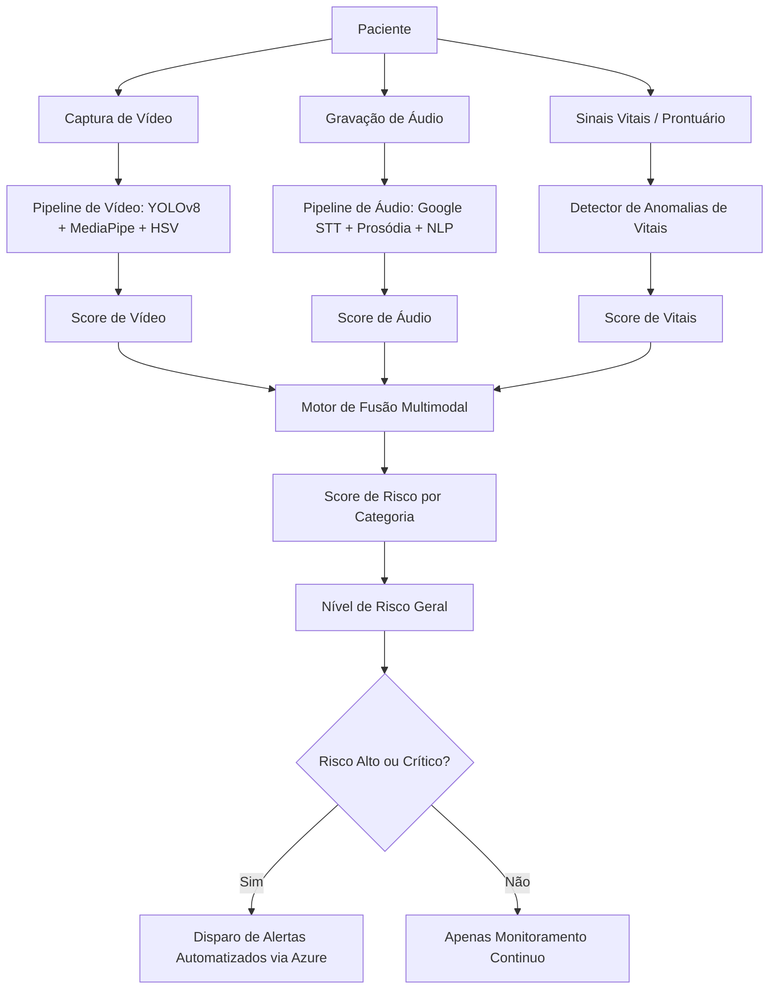

# Tech Challenge - Fase 4: IA Multimodal na Saúde e Segurança da Mulher

Este repositório contém a solução completa para o **Tech Challenge - Fase 4**, um sistema de inteligência artificial multimodal projetado para monitorar continuamente pacientes no contexto da saúde e segurança feminina, identificando sinais precoces de risco por meio da análise integrada de dados de vídeo, áudio e sinais vitais.

---

## 1. Descrição do Fluxo Multimodal

O sistema utiliza um modelo de **Fusão Multimodal Tardia (Late Fusion)**, em que cada modalidade de dados (vídeo, áudio e sinais vitais) é processada de forma independente por pipelines dedicados. Esses pipelines extraem scores de risco específicos para cada contexto clínico, que são então combinados matematicamente em um motor de fusão central para obter o nível de risco geral da paciente.

O fluxo de dados ocorre nas seguintes etapas:



### Regras de Ponderação e Fusão
Os scores das modalidades são combinados por categoria de risco com base em matrizes de pesos ajustados ao domínio médico:

1. **Saúde Materna**
   - Sinais Vitais: **70%** (peso predominante devido à criticidade de PA/BCF)
   - Áudio (relato do paciente): **30%**
2. **Complicação Cirúrgica**
   - Vídeo (sangramento / instrumentação): **100%**
3. **Violência Doméstica**
   - Áudio (verbalização / tom de voz): **50%**
   - Vídeo (linguagem corporal / autoproteção): **50%**
4. **Saúde Psicológica**
   - Áudio (prosódia / termos depressivos): **70%**
   - Vídeo (indicadores visuais de desconforto): **30%**
5. **Anomalia Ginecológica**
   - Sinais Vitais (prescrição hormonal incorreta): **50%**
   - Vídeo (sangramento anômalo em consulta): **50%**

Quando o nível de risco final é classificado como **Alto** ou **Crítico**, o sistema gera alertas automáticos e os despacha para os canais corretos da equipe médica (ex.: obstetrícia, serviço social, centro cirúrgico).

---

## 2. Modelos de IA Aplicados por Modalidade

### 2.1 Análise de Vídeo
* **Detecção de Objetos (YOLOv8):** Um modelo YOLOv8 customizado é carregado para localizar em tempo real instrumentos cirúrgicos ginecológicos e estruturas anatômicas críticas (útero, ovários, mamas).
* **Processamento de Imagem (Segmantação HSV):** Utiliza algoritmos de visão computacional em espaço de cor HSV para calcular a taxa de coloração vermelha em regiões críticas, estimando o score de sangramento cirúrgico.
* **Análise Comportamental (MediaPipe):** Processa landmarks faciais e corporais para calcular taxas de piscar de olhos, evitação de olhar, movimentos bruscos (sobressalto) e gestos de autoproteção para inferir desconforto psicológico e corporal.

### 2.2 Análise de Áudio
* **Transcrição (Google Cloud Speech-to-Text):** Transcreve com alta fidelidade a voz da paciente em consultas para português brasileiro.
* **Extração de Entidades Clínicas (Azure AI Language - Text Analytics for Health):** Analisa o texto transcrito em busca de termos médicos, sintomas relatados e medicamentos referenciados.
* **Classificação de Risco Vocal (Prosódia + NLP):** Combina features acústicas extraídas com `librosa` (pitch, jitter, pausas e velocidade de fala) com análises léxicas do texto para computar a probabilidade de ansiedade, depressão pós-parto ou trauma por violência.

### 2.3 Análise de Sinais Vitais
* **Detector Rule-Based Baseado em Diretrizes Médicas:**
  - **Pressão Arterial:** Alerta hipertensão gestacional (140/90 mmHg, risco crítico de pré-eclâmpsia (160/110 mmHg) e tendências de elevação consecutiva.
  - **Frequência Cardíaca Fetal (BCF):** Detecta taquicardia fetal ()>160 bpm) e bradicardia fetal (< 110 bpm).
  - **Dosagem Hormonal:** Monitora dosagem de medicamentos prescritos (estradiol, progesterona, levonorgestrel) contra limites máximos diários tolerados.

---

## 3. Resultados Obtidos e Casos de Demonstração (Seed)

O banco de dados do projeto vem pré-populado com 5 cenários clínicos simulados cobrindo os requisitos exigidos:

### Caso 1: Maria Silva (Pré-Natal - Risco Médio para Alto)
* **Histórico de Sinais Vitais:** Apresenta aumento progressivo da Pressão Sistólica nas últimas 7 consultas acompanhado de proteinúria leve.
* **Áudio:** Transcrição indica ansiedade extrema relacionada ao parto ("Doutora, estou muito preocupada, não consigo parar de pensar no parto, meu coração fica acelerado...").
* **Resultado:** Risco de Saúde Materna elevado, gerando encaminhamento para triagem obstétrica.

### Caso 2: Ana Costa (Pós-Parto - Risco Alto)
* **Sinais Vitais:** Normotensa (PA 111/72 mmHg).
* **Áudio:** Padrão vocal com velocidade de fala lenta e tom monótono. Transcrição revela sintomas clássicos de depressão pós-parto ("Eu não sinto vontade de fazer nada, estou sempre cansada, às vezes fico chorando sem motivo...").
* **Resultado:** Score de saúde psicológica de **0.87**, disparando alerta direcionado à equipe de psicologia perinatal.

### Caso 3: Julia Santos (Triagem de Violência - Risco Alto)
* **Vídeo:** Gestos de autoproteção frequentes e baixo contato visual com a câmera.
* **Áudio:** Longas pausas, hesitação de voz e termos de medo ("Eu... não sei se posso falar isso. Ele controla tudo, tenho medo dele.").
* **Resultado:** Fusão gera risco de Violência Doméstica com score de **0.77**, disparando alerta direto para o serviço social do hospital.

### Caso 4: Carla Oliveira (Consulta Ginecológica - Risco Baixo)
* **Sinais Vitais & Prescrição:** Em uso de estradiol dentro dos limites recomendados de dosagem (2.0 mg).
* **Resultado:** Classificada em nível de risco baixo geral. Apenas monitoramento de rotina.

### Caso 5: Patricia Lima (Caso Crítico)
* **Sinais Vitais:** PA crítica de 165/112 mmHg acompanhada de bradicardia fetal severa (95 bpm).
* **Vídeo:** Sangramento cirúrgico identificado com score de **0.22**.
* **Resultado:** Classificação de risco **Crítico**, exigindo intervenção médica imediata com despachos urgentes de e-mail e alertas sonoros no painel.

---

## 4. Instalação e Execução Local

### Pré-requisitos
* Python 3.12+
* SQLite3

### Instalação

1. Clone o repositório e navegue até a pasta do projeto:
   ```bash
   cd women-health-ai
   ```

2. Crie e ative um ambiente virtual:
   ```bash
   python -m venv .venv
   # No Windows (PowerShell):
   .venv\Scripts\Activate.ps1
   # No Linux/Mac:
   source .venv/bin/activate
   ```

3. Instale as dependências:
   ```bash
   pip install -r requirements.txt
   ```

4. Popule o banco de dados inicial (SQLite):
   ```bash
   python seed_db.py
   ```

### Executando a Aplicação
Inicie o servidor de desenvolvimento do FastAPI:
```bash
uvicorn src.api.main:app --reload --port 8000
```
Acesse a aplicação no navegador em: **`http://127.0.0.1:8000`**

---

## 5. Deploy no Azure App Service

O projeto está totalmente configurado para deploy no **Azure App Service (Linux, runtime Python 3.12)**.

### Variáveis de Ambiente necessárias (Application Settings)
As seguintes variáveis devem ser cadastradas na aba de Configurações do App Service:

| Variável | Descrição |
|---|---|
| `AZURE_LANGUAGE_KEY` | Chave de acesso do Azure AI Language (Text Analytics) |
| `AZURE_LANGUAGE_ENDPOINT` | Endpoint do Azure AI Language |
| `AZURE_COMMUNICATION_CONNECTION_STRING` | String de conexão para o Azure Communication Services (e-mail) |
| `GOOGLE_APPLICATION_CREDENTIALS` | `/home/credentials/google-credentials.json` (se usar Speech-to-Text real) |
| `WEBSITES_PORT` | `8000` |
| `SCM_DO_BUILD_DURING_DEPLOYMENT` | `true` |

### Script de Inicialização (Startup Command)
Configure o comando de inicialização nas configurações gerais do App Service como:
```bash
bash startup.sh
```
Isso garante a migração e seed corretos do banco de dados SQLite persistente em `/home/data/saude_mulher.db` antes da subida dos workers do Gunicorn.
